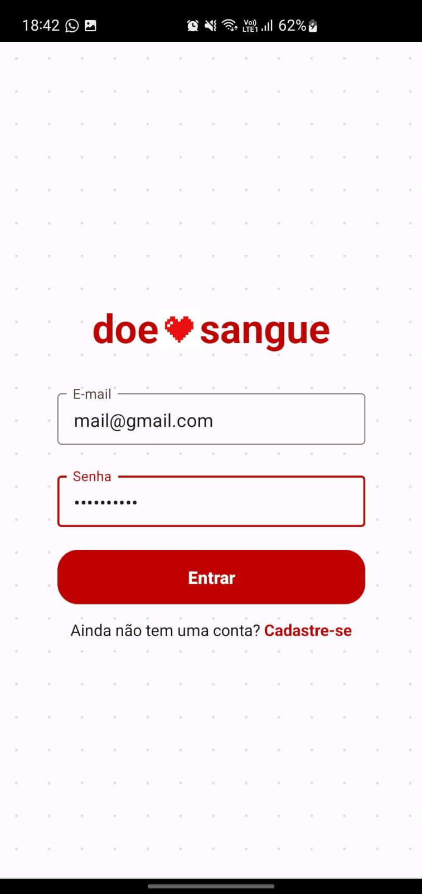
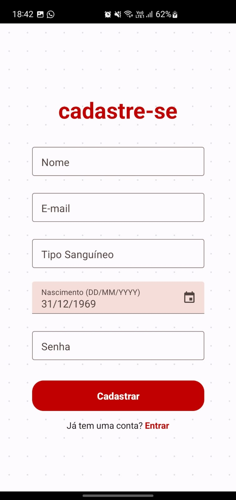

# Doe Sangue


<br/>
[](https://sonarcloud.io/summary/new_code?id=kalebzmm_doesangue)
[](https://sonarcloud.io/summary/new_code?id=kalebzmm_doesangue)
[](https://sonarcloud.io/summary/new_code?id=kalebzmm_doesangue)
[](https://sonarcloud.io/summary/new_code?id=kalebzmm_doesangue)
[](https://sonarcloud.io/summary/new_code?id=kalebzmm_doesangue)
[](https://sonarcloud.io/summary/new_code?id=kalebzmm_doesangue)

<div align="center">
    
</div>

> O projeto tem como objetivo criar um aplicativo que _melhore a experiência_ o processo de doação de sangue desde as instruções para doação, agendamento em hemocentros cadastrados e acompanhamento do período até que o usuário esteja habilitado para doar novamente.

> A motivação principal do projeto é o incentivo a doação de sangue, prática que sendo normalizada pode beneficiar milhões de pessoas em todo o mundo que necessitam de transfusão.

## Telas de autenticação
<table>
    <tr>
        <td>
            
        </td>
        <td>
            
        </td>
    </tr>
</table>

## Ajustes e melhorias

O projeto ainda está em desenvolvimento e as próximas atualizações serão voltadas nas seguintes tarefas:

- [X] Mockup das telas
- [X] Telas de autenticação de cadastro
- [X] Telas de agendamento 
- [ ] Telas de notificação
- [ ] Telas de espera da próxima doação

## 💻 Pré-requisitos

Antes de começar, verifique se você atendeu aos seguintes requisitos:
* Você seguiu todas as etapas para instalação do [React Native](https://reactnative.dev/docs/environment-setup)

## 🚀 Instalando a aplicação

Para instalar as dependências da aplicação, rode o seguinte comando na pasta do projeto:

```
npm install
```

## ☕ Usando

Para usar o aplicativo, siga estas etapas:

```
npx react-native run-android
```

## 📫 Contribuindo para Doe Sangue
Para contribuir com Doe Sangue, siga estas etapas:

1. Bifurque este repositório.
2. Crie um branch: `git checkout -b <nome_branch>`.
3. Faça suas alterações e confirme-as: `git commit -m '<mensagem_commit>'`
4. Envie para o branch original: `git push origin doesangue / master`
5. Crie a solicitação de pull.

Como alternativa, consulte a documentação do GitHub em [como criar uma solicitação pull](https://help.github.com/en/github/collaborating-with-issues-and-pull-requests/creating-a-pull-request).

## 📝 Licença

Esse projeto está sob licença. Veja o arquivo [LICENÇA](LICENSE.md) para mais detalhes.

[⬆ Voltar ao topo](#DoeSangue)<br>
